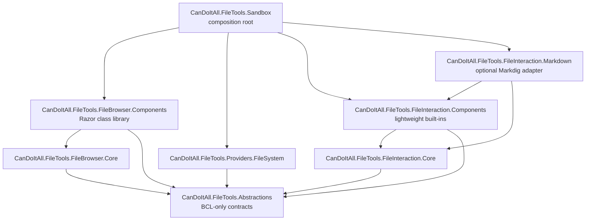

# C# Boundary Map

## Target project graph

Tests reference only their product targets plus Abstractions. No production project references a test or Sandbox project.

## Ownership

| Project | Owns | Must not own |
| --- | --- | --- |
| Abstractions | identity, descriptors, queries/pages, source/provider capabilities, content leases, file revision/version, interaction modes/capabilities, save requests, autosave/preview options, history interfaces | runtime state, Blazor, caching, filesystem, SDKs, persistence, renderer component types |
| FileBrowser.Core | catalogs, provider validation, navigation, ordering, search, session orchestration, explicit state-retention policy | concrete storage, Blazor, CanDoItAll domain entities, cross-request cache |
| FileBrowser.Components | FileBrowser markup, native controls, density/chrome modes, UI projections, EventCallbacks, component-scoped JS/CSS | provider construction, storage writes, host navigation/download, FileInteraction |
| Providers.FileSystem | root-confined path handles, enumeration, stat/metadata, range read, filesystem-specific capabilities | cache, UI, host OS-open action, arbitrary roots outside options |
| FileInteraction.Core | profile/catalog matching, save/preview schedulers, edit state, bounded text history, revision/conflict rules | renderer component types, filesystem/storage writes, global assets |
| FileInteraction.Components | shell, DynamicComponent registry, text/image/PDF built-ins, edit/preview composition, toolbar/history controls | Markdig, Mermaid, Office SDKs, host persistence |
| FileInteraction.Markdown | optional Markdig viewer/editor profile and registration | browser runtime, storage, unrelated renderers |
| Sandbox | DI composition and visual scenario matrix | reusable product behavior |

## Contract/implementation split

- Provider contracts return immutable descriptive data and owned content leases.
- Browser and interaction sessions consume contracts but never know a CanDoItAll driver or project entity.
- Concrete host adapters translate main-domain scope/storage types into FileTools source descriptors.
- Renderer registrations map a neutral interaction profile to Blazor components only inside RCL packages.

## Composition roots

- FileTools Sandbox explicitly registers chosen browser, filesystem, interaction, and Markdown packages.
- Future CanDoItAll Composition explicitly registers FileTools and selected host adapters/renderers. It must not rely on assembly scanning that loads every editor.

## Old ownership removal

After FileTools restore/build/test/browser proof passes:

1. remove FileBrowser source/test/sandbox/docs/package script ownership from Components;
2. update its solution, CI, release script, root README, and release checklist;
3. keep Components.BaseLib/Common/Mermaid and generic tooltip fixes;
4. do not delete `*.csproj.user`, generated output, or unrelated screenshots as part of the move;
5. record a manifest proving every transferred production/test responsibility exists in FileTools first.

## Temporary bridges

- No cross-repository ProjectReference is allowed as a final state.
- A temporary namespace compatibility shim is allowed only if a real consumer is found; current inventory found none outside tests/sandbox/docs, so the preferred path is a clean package rename.
- CanDoItAll integration remains documentation-only in this run and is not a compiled bridge.

