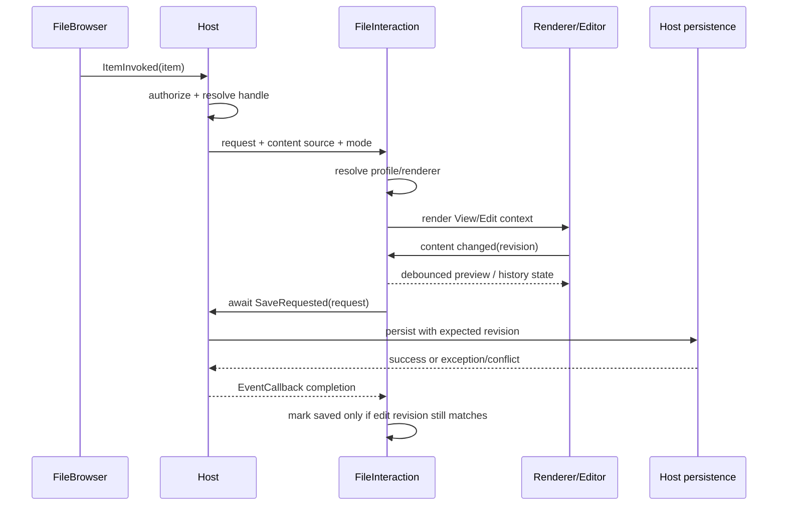

# FileInteraction Design

## Separation from FileBrowser

FileBrowser stops at activation. The host resolves an authorized, stable file handle and opens FileInteraction with content access plus optional current revision. FileInteraction never reaches back into the browser session or main storage driver.

## Neutral contracts

- `FileInteractionMode`: `View`, `Edit`, reserved `Diff`.
- `FileInteractionCapabilities`: view/edit/preview/undo/redo/diff/save.
- `FileInteractionRequest`: stable handle, name, extension/media type, optional size/revision, requested mode.
- `IFileContentSource`: open bounded/range content independent of browser session lifetime.
- `FileSaveRequest`: handle, expected base revision, edit revision, media type/encoding, replayable content payload/stream factory defined by the chosen bounded contract.
- `IFileInteractionProfile`: type matching, modes, priority, preview/save/history defaults.
- `IFileEditHistoryProvider`: record, undo, redo, clear, state change; file-type-specific implementations optional.

## Resolution

Score exact media type above suffix media pattern, then exact extension, then wildcard/fallback. Filter by requested mode/capability first. Highest score/priority wins; equal final scores are an explicit ambiguity error. Do not hide extension/MIME disagreement; profiles can declare policy and tests cover it.

## Save semantics

- Manual save is always available for editable profiles unless host disables persistence.
- Automatic strategies: interval, idle-after-change, edit-count, cumulative changed UTF-16 text units, or a validated composite. The text-unit counter removes the unchanged prefix/suffix before accumulating replacement size; it is deliberately not a grapheme counter.
- Autosave availability is evaluated dynamically. If the host save callback is temporarily unavailable, one pending intent is retained and retried when availability returns instead of silently losing the threshold/idle event.
- Changes coalesce; at most one save runs for a session.
- `SaveRequested.InvokeAsync` is awaited. Completion means host persistence succeeded; exception/conflict leaves dirty state and surfaces an error.
- A save for edit revision N cannot clear dirty state for revision N+1.
- Switching file/mode cancels pending delay/preview/save intent and resets history according to revision policy.

## Preview

- Profile defaults define whether split preview is supported, placement, minimum delay, and maximum concurrency.
- Debounce uses `Task.Delay` plus CTS, never timers or `Task.Run`.
- A preview result carries its edit revision together with the media type and encoding from the same content snapshot; stale completions are discarded as one unit.
- Heavy renderers can use a longer delay or manual preview policy.

## History

- The shell asks the selected profile/factory for history. Factories have an explicit priority; the highest matching factory wins and an equal highest priority is an ambiguity error. The generic bounded-text factory is a low-priority fallback so a file-specific provider can replace it cleanly. If no factory matches, undo/redo controls are disabled/hidden.
- Included text history stores bounded immutable snapshots or deltas under configured entry/byte limits.
- Recording after Undo truncates the redo branch.
- History cannot cross file handle/base revision and is cleared after external replacement/conflict resolution.

## Renderer packaging

- Base interaction RCL: shell, text view/edit, a small exact set of browser-supported raster image media, opt-in browser PDF/object view, and unsupported/inert metadata state. SVG and unknown image media stay inert unless a host registers a deliberate sanitizing/specialized renderer.
- Optional Markdown RCL: Markdig-based view/edit split and profile registration. Its default pipeline disables raw HTML and emits link, autolink, and image syntax as inert text without `href`/`src`, so the built-in renderer cannot navigate or fetch from document content. A host may replace that deliberately conservative policy only when it owns an explicit sanitization/trust decision.
- Mermaid remains a host-registered adapter around the simple Components Mermaid wrapper in CanDoItAll; the Sandbox proves the extension seam with a local demo renderer without making the base shell depend on it.
- CSV/XLSX/DOCX/media/diff packages are future additions behind the same registration contracts.

## Renderer trust boundary

- File bytes, Markdown, file names, paths, metadata, and provider error text are untrusted display input.
- Base text rendering remains encoded by Razor. Approved raster-image/PDF bytes are exposed through component-owned object URLs that are generation checked, hidden during replacement, and revoked on replacement/disposal; raster decode errors fall back inertly.
- Full loads and edit replacements share a validated maximum byte bound. Oversized renderer changes are rejected without replacing the current edit snapshot or breaking the Blazor circuit.
- Object URL creation/revocation is serialized and generation checked: a slow old JS result cannot replace a newer file or survive disposal. The rendered target must also be replaced/hidden until the new content's load readiness, so the old file is not transiently disclosed.
- The built-in PDF surface delegates document rendering and any internal link behavior to the browser. A host with a stricter no-navigation policy should omit that registration and supply a sandboxed/sanitized renderer or an explicit host action; the package must not describe browser PDF internals as FileTools-authorized effects.
- The included Markdown adapter uses Markdig's HTML-disabled pipeline and rejects dangerous or ambient-fetch URL schemes. Raw HTML suppression alone is insufficient because a Markdown link can still produce a `javascript:`, `data:`, `blob:`, or similarly active URL.
- Link navigation, downloads, external opens, clipboard writes, and storage mutations remain host decisions; a renderer does not turn file content into ambient application authority.
