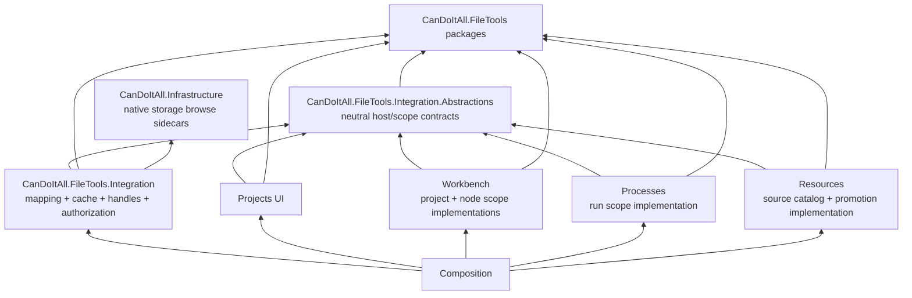

# Future CanDoItAll Integration Architecture

This is implementation-ready design only. `C:/repositories/CanDoItAll` remains read-only in this run. Because Workbench and Processes are actively changing, the future implementation must begin with the re-entry gate below rather than treating these anchors as permanent.

## Re-audit evidence and current graph

- Cross-project snapshot `snap-20260711132548-8a755009` remains the usable broad graph baseline (8 projects/188 documents).
- Infrastructure snapshot `snap-20260711171556-e982f9a8` is healthy (49 documents, 195 types, 1,093 members, 37 DI registrations, 4 entities, no blocking diagnostics); it retains one pre-existing module-level cycle inside Infrastructure.
- Projects snapshot `snap-20260711172123-af247a67` is healthy (15 documents, 58 types, 302 members, 4 registrations, no diagnostics or cycles).
- Full-solution and 11-project refresh attempts were time-boxed during the re-audit because MSBuild loading did not complete promptly. The healthy narrow snapshots plus exact current `.csproj` reads are the planning evidence; fresh scoped snapshots are mandatory at implementation re-entry.

Current reference facts that constrain the design:

- Projects -> Infrastructure.
- Resources -> Infrastructure and Projects.
- Workbench -> Infrastructure, Projects, Resources, and Processes.Application.
- Processes module -> Infrastructure, Processes.Application/Persistence/Projections/Runtime and related process projects.
- Composition -> Infrastructure, Projects, Workbench, Processes, Resources, and the other application modules.
- No project-level cycle was found in the usable cross-project snapshot. Do not introduce one while adding integration contracts.

## Target dependency boundary



`CanDoItAll.FileTools.Integration.Abstractions` is the small main-repository boundary. It may use FileTools neutral descriptors but must not depend on Infrastructure persistence entities, Workbench types, process persistence records, or UI components. The outer integration adapter is the only planned owner that maps Infrastructure-native browse DTOs to FileTools, applies cache policy, creates authenticated handles, and reauthorizes content/save operations.

Semantic scope implementations stay with the module that owns their meaning:

- Workbench implements project aggregate and project-structure node scopes.
- Processes implements process-run scopes.
- Resources implements its browse source catalog and resource-promotion workflow.
- Projects consumes the neutral project-scope contract for its UI but does not implement a Workbench concern.
- Composition registers implementations against the neutral contracts. Modules must not reference the outer adapter implementation project.

Forbidden edges:

- FileTools -> any CanDoItAll project.
- Infrastructure -> FileTools, the outer integration adapter, or a module.
- Projects -> Workbench or Resources.
- Resources -> Workbench.
- Processes/Application -> Workbench. A process path policy can be consumed by Workbench, never owned in reverse by Workbench and called from Processes.
- Any module -> the outer integration implementation merely to locate a service; consume Integration.Abstractions instead.

## Infrastructure-native storage browsing

Current anchors:

- `repo://CanDoItAll/src/Foundation/CanDoItAll.Infrastructure/Storage/Abstractions/StorageContracts.cs`
- `repo://CanDoItAll/src/Foundation/CanDoItAll.Infrastructure/Storage/Models/StorageModels.cs`
- `repo://CanDoItAll/src/Foundation/CanDoItAll.Infrastructure/Storage/Persistence/StoragePersistenceModels.cs`
- `repo://CanDoItAll/src/Foundation/CanDoItAll.Infrastructure/Storage/Persistence/StorageCatalogService.cs`
- `repo://CanDoItAll/src/Foundation/CanDoItAll.Infrastructure/DependencyInjection/InfrastructureServiceCollectionExtensions.cs`

`IStorageDriver` currently exposes test/save/open-read/delete plus provider/capability metadata; it has no browse/list/stat/search/paging contract. Do not enlarge it with operations every provider cannot honor. Add Infrastructure-native sidecars:

- `IStorageBrowseDriver` for bounded list/stat and explicitly advertised optional operations;
- `IStorageBrowseDriverRegistry`, keyed by provider kind/binding;
- native `StorageBrowseRequest`, `StorageBrowsePage`, `StorageBrowseEntry`, and continuation/value records that contain no FileTools type;
- provider-specific filesystem/IPFS/FTP implementations beside the existing storage drivers;
- capability validation so unsupported search, rename, directory creation, or recursive enumeration fails explicitly.

Infrastructure registration currently places storage services at lines 99-112 of `InfrastructureServiceCollectionExtensions.cs` and has no `HybridCache`/`IMemoryCache` listing registration. Register the native browse registry there only. Register FileTools mapping/cache/handle services in the outer integration project and Composition, preserving Infrastructure's independence.

`StorageProviderConfiguration` has no typed browse-cache setting today. Add a backward-compatible `StorageBrowseCacheSettings` object to each provider configuration serialized in `StorageCatalogRecord.ConfigJson`, with:

- `Enabled` plus validated `Disabled`, `Memory`, or `Hybrid` mode (`Enabled == false` normalizes to `Disabled`);
- normal TTL and a hard maximum TTL;
- maximum page size and maximum cached item count;
- whether an authorized caller may force refresh;
- immutable mode only when the provider proves the addressed version is immutable (for example, a CID), never from a user flag alone.

Missing settings deserialize to Disabled. Do not put these operational settings in `MetadataJson`, and do not add a database table in the first delivery. `StorageCatalogRecord.UpdatedAtUtc` is configuration/bootstrap activity, not file-set freshness and must not be a listing revision.

In the initial delivery, Memory is implemented through HybridCache with no distributed secondary. Hybrid mode is rejected/fails closed until a distributed provider and durable/shared revision contract pass their separate gate.

## Authorization and opaque server handles

`StorageJson.EncodeReferenceToken` (`StorageJson.cs`, lines 79-87) is unsigned base64url JSON. It is a transport encoding, not authority. Neither it nor a rooted path/file existence check may authorize browse, open, download, edit, or save.

The outer integration adds:

- principal-aware `IFileScopeAuthorizationService` for tenant/user/grant checks against the semantic scope and storage binding;
- bounded `IFileHandleRegistry` issuing cryptographically random opaque handles bound to principal/tenant, source/binding, item identity, allowed operations, revision, and expiry;
- a content/save gateway that resolves the handle server-side, re-resolves the item, repeats authorization, validates the expected revision, and only then invokes Infrastructure;
- eviction on expiry, logout/profile switch, binding removal, or authorization revision change.

FileTools identities remain portable descriptive identities. They are never authorization credentials. Do not cache or expose raw secrets, streams, signed URLs, decoded storage reference tokens, or handles belonging to another principal.

## Neutral integration contracts

Keep only stable contracts in Integration.Abstractions:

- `IProjectFileScopeProvider`
- `IProjectStructureNodeFileScopeProvider`
- `IProcessRunFileScopeProvider`
- `IResourceFileSourceProvider`
- `IFileScopeAuthorizationService`
- `IFileCatalogRevisionService`
- `IFileBrowseCachePolicyResolver`
- handle/content/save gateway contracts whose implementations live in the outer adapter

The contracts return FileTools source descriptors/session factories or neutral scope requests. They never return `Project`, `ProcessRun`, `StorageCatalogRecord`, Workbench node entities, EF entities, or raw absolute paths.

## Projects module

Exact current anchors:

- `repo://CanDoItAll/src/Modules/CanDoItAll.Modules.Projects/Pages/ProjectsPage.razor` - route `/projects`; `FilteredProjectSummaries` at lines 240-251 and recursive hierarchy scope logic at lines 646-694.
- `repo://CanDoItAll/src/Modules/CanDoItAll.Modules.Projects/Pages/Components/ProjectsBoard.razor` - filters and card surface in one 666-line component; card actions at lines 363-416 and callbacks at lines 427-513.
- `repo://CanDoItAll/src/Modules/CanDoItAll.Modules.Projects/Pages/Components/ProjectModalHost.razor`
- `repo://CanDoItAll/src/Modules/CanDoItAll.Modules.Projects/ProjectModels.cs` - `ProjectSummary` at line 154, `ProjectHierarchyLinkSummary` at line 173, `ProjectsService` at line 230.

Implementation design:

1. Extract a pure, directly tested, cycle-safe `ProjectHierarchyScopeResolver` from `ProjectsPage`. It accepts project ids/links and returns the selected closure without constructing the page.
2. Do not simply wrap `ProjectsBoard` in Projects/Files tabs: the board owns the filters, so that would hide the controls required to define the Files source set. Extract shared portfolio controls/workspace shell, then render focused `ProjectCardsPane` and `ProjectsFilesPane` children over the same `FilteredProjectSummaries`.
3. Build the Files composite from a deterministic source-set fingerprint: ordered filtered project ids, hierarchy filter/include-subprojects state, and project catalog revision. Updating any dimension replaces/updates the browser source set without retaining an invalid location.
4. Add `OpenFiles : EventCallback<Guid>` to the card surface and a compact Files action beside the existing details/hierarchy/dashboard/structure/process/calendar/Gantt actions.
5. Add a focused `ProjectFilesDialog.razor` owned by the Projects UI. Do not enlarge `ProjectModalHost` or the already broad `ProjectsPage` with FileBrowser runtime responsibilities.
6. The UI consumes `IProjectFileScopeProvider`; the module-owned implementation is registered from Workbench through Composition, so Projects never references Workbench.

## Project structure canvas and folder nodes

Exact current anchors:

- `repo://CanDoItAll/src/Modules/CanDoItAll.Modules.Workbench/Pages/ProjectStructurePage.razor` - route `/projects/{ProjectId}/structure`, toolbar at lines 91-113, floating windows from line 126.
- `repo://CanDoItAll/src/Modules/CanDoItAll.Modules.Workbench/Pages/ProjectStructurePage.ToolWindows.cs`
- `repo://CanDoItAll/src/Modules/CanDoItAll.Modules.Workbench/Pages/Components/ProjectStructure/ProjectStructureToolbarActions.razor`
- `repo://CanDoItAll/src/Modules/CanDoItAll.Modules.Workbench/ProjectStructure/ProjectStructureLocalFileOpener.cs`
- `repo://CanDoItAll/src/Modules/CanDoItAll.Modules.Workbench/ProjectStructure/ProjectStructureNodeActionCapabilityResolver.cs`
- `repo://CanDoItAll/src/Modules/CanDoItAll.Modules.Workbench/CanvasAdapters/ProjectStructureActionCatalogAdapter.cs`
- `repo://CanDoItAll/src/Modules/CanDoItAll.Modules.Workbench/ProjectStructure/ProjectStructureMenuComposition.cs`
- `repo://CanDoItAll/src/Modules/CanDoItAll.Modules.Workbench/Pages/ProjectStructurePage.NodeQuickActions.cs`
- `repo://CanDoItAll/src/Modules/CanDoItAll.Modules.Workbench/Pages/ProjectStructurePage.NodeEditing.cs`

Security correction: `ProjectStructureLocalFileOpener` is not a browse authorization boundary. Its resolver is private, accepts an existing rooted metadata path at lines 178-202, covers File/Repository/Infrastructure metadata at lines 218-255, and does not cover ProjectBlock `OutputRoot`, `ProductRoot`, `TargetRoot`, `RepositoryRoot`, or `WorkspaceRoot`. Reusing it would turn path existence into authority.

Implementation design:

1. Add a Workbench `IProjectStructureNodeFileScopeResolver` that interprets supported node metadata into candidate semantic scopes. Pass every candidate through `IFileScopeAuthorizationService`.
2. Authorize only workspace/managed roots or configured external storage bindings granted to the current principal. Reject arbitrary absolute metadata paths even when they exist.
3. Add a focused action coordinator/handler for `browse-files` before wiring it into the currently duplicated quick-action, edit, page-switch, adapter, and menu-composition surfaces. Avoid another set of parallel switch arms.
4. Add toolbar action and persisted window key `project-structure.files`.
5. Create the planned file `src/Modules/CanDoItAll.Modules.Workbench/Pages/Components/ProjectStructure/ProjectStructureFileBrowserWindow.razor` with Compact/Minimal density, an independent session lifetime, and a host-owned Include subprojects checkbox.
6. Keep the existing `open-local` behavior separate. `browse-files` returns an authorized scope and opaque handles; it does not open the OS explorer.
7. Project aggregate browsing may use the optional host cache. A directly opened working/output OS folder does not.

## Process-run history

Exact current anchors:

- `repo://CanDoItAll/src/Modules/CanDoItAll.Modules.Processes/Pages/LiveProcessesPage.razor` - routes `/processes/live` and `/projects/{ProjectId}/processes/live`.
- `repo://CanDoItAll/src/Modules/CanDoItAll.Modules.Processes/Components/LiveProcessesDashboard.razor` - existing run-details dialog at lines 200-221 and `RenderRunDetailDialog` around line 1412; do not add another responsibility to this 2,888-line owner.
- `repo://CanDoItAll/src/Processes/CanDoItAll.Processes.Application/ProcessLaunchApplicationService.cs` - `BuildManagedProcessArtifactRoot` around line 1583.
- `repo://CanDoItAll/src/Processes/CanDoItAll.Processes.Runtime/ProcessRuntimeStepAssignments.cs` - `IProcessRuntimeStepAssignmentStore.LoadByRunAsync` exposes launch-variable inspection needed to resolve output/product roots.
- `repo://CanDoItAll/src/Modules/CanDoItAll.Modules.Workbench/ProjectStructure/ProjectStructureProcessRunFolderProjectionPolicy.cs`

Implementation design:

1. Extract the neutral managed/output/product/workspace run-root policy to Processes.Application (or a small process integration-core project). Workbench already references Processes.Application and consumes/maps that policy. Processes must never reference Workbench.
2. Implement `IProcessRunFileScopeProvider` in the Processes boundary. Aggregate `ManagedArtifactRoot`, `OutputRoot`, and `ProductRoot` only after re-resolving launch data and authorizing each root.
3. Add a focused `ProcessRunFilesDialog.razor`; the dashboard keeps only open/close/run-id state and an action in the existing run-details surface.
4. Managed and external working roots use host cache Disabled and FileBrowser session retention Disabled. Re-enumerate on dialog open and explicit refresh because agent writes can bypass DI.

## Resources module

Exact current anchors:

- `repo://CanDoItAll/src/Modules/CanDoItAll.Modules.Resources/Pages/ResourcesPage.razor`
- `repo://CanDoItAll/src/Modules/CanDoItAll.Modules.Resources/Pages/ResourcesPage.razor.cs`
- `repo://CanDoItAll/src/Modules/CanDoItAll.Modules.Resources/ResourceModels.cs`
- `repo://CanDoItAll/src/Modules/CanDoItAll.Modules.Resources/ResourceConnectorPlugins.cs`
- `repo://CanDoItAll/src/Modules/CanDoItAll.Modules.Resources/ResourceSourceSnapshotProvider.cs`

The page already uses a registry/list-detail shell, so Registry/Browse tabs are a natural split. The current connector catalog has repository, folder, file, FTP, and other connectors, but no IPFS or generic storage-object resource connector. Browsing an item therefore cannot yet close the requested Add as resource flow for IPFS/storage objects.

Implementation design:

1. Add a generic `resource.storage-object` connector (preferred) that stores a stable storage binding/object locator, or add a narrower `resource.ipfs` connector if the storage model cannot represent provider-neutral objects. This prerequisite must land before Resources promotion is considered complete.
2. Add Registry/Browse tabs and a module-owned source catalog combining project composites and authorized configured filesystem/IPFS/FTP bindings.
3. Add as resource is a host command: re-resolve and reauthorize the selected browser item, then populate `ResourceEditorModel`. Never trust the display path, browser metadata, or opaque handle as persisted configuration.
4. Attachment/source-set changes bump the resources/project catalog revision and invalidate only the affected aggregate.
5. Do not reuse the name `ResourceSourceSnapshotProvider` for file browsing; that existing type snapshots memory-source content, not a FileBrowser source catalog.

## FileInteraction migration

Current Workbench preview owners:

- `ProjectStructureCanvasDialogs.razor` for image/video/audio/pre/iframe;
- `ProjectStructurePage.Workflows.cs` for Mermaid routing;
- `ProjectStructureSupportDialogs.razor` for `MermaidDiagram`;
- `ProjectStructureNodeHelpers.cs` for content classification.

Migrate incrementally after browsing is secure and stable:

```text
FileBrowser activation
 -> host resolves opaque handle and repeats access checks
 -> host opens FileInteraction
 -> selected registered viewer/editor
 -> awaited save returns through host adapter with expected revision
 -> host persists, emits change, and bumps in-memory catalog revision
```

Keep the Mermaid wrapper in CanDoItAll.Components and register a host-side FileInteraction renderer adapter. Register only selected image/PDF/Markdown/Mermaid/editor packages.

## Cache and revision placement

The initial CanDoItAll delivery uses HybridCache with memory primary only and an in-memory `IFileCatalogRevisionService`/change sink. A restart discards both cached listings and process-local revisions, so no project table/timestamp is needed now. A durable/distributed revision store and cross-node invalidation/backplane become prerequisites only before enabling a distributed HybridCache secondary.

Every cache key includes the runtime/database snapshot fingerprint from `IDatabaseRuntimeState.GetSnapshot()`, source/binding id, semantic scope, source-set fingerprint, catalog revision/immutable version, normalized query/page fingerprint, and an authorization-scope fingerprint. An alternative is to cache only provider-raw preauthorization listings and filter/authorize after retrieval. Never cache principal-specific handles or unfiltered data under a shared key. Full policy is in `architecture/08-cache-and-invalidation.md`.

## Composition order

At `repo://CanDoItAll/src/App/CanDoItAll.Composition/RuntimeHostServiceCollectionExtensions.cs`, Web startup, and module registration roots:

1. FileTools Abstractions/Core and selected component packages;
2. Integration.Abstractions;
3. Infrastructure-native browse sidecars/registry and typed settings;
4. outer mapping, authorization, handle, content, and save adapters;
5. no-cache filesystem/process source adapters;
6. HybridCache memory-primary decorator, cache-policy resolver, and in-memory catalog revision/change sink;
7. Workbench project/node, Processes run, and Resources catalog/promotion implementations;
8. module UI coordinators/windows/dialogs and selected FileInteraction renderers.

Build one explicit `FileInteractionComponentComposition` containing only selected renderers/editors. Do not assembly-scan every extension, call `BuildServiceProvider` during registration, or register a provider merely because its package is referenced.

## Corrected future execution phases and gates

1. Fresh scoped CodeAnalytics snapshots, exact `.csproj` graph, volatile-source re-entry, and unchanged-main baseline.
2. Add FileTools package references and `CanDoItAll.FileTools.Integration.Abstractions`; prove the target graph and forbidden-edge gate.
3. Add Infrastructure-native browse sidecars, registry, typed `ConfigJson` settings, capability bounds, and provider contract tests.
4. Add outer mapping, principal authorization, opaque server handle registry, content/save adapters, and adversarial cross-principal/path/token tests.
5. Implement uncached filesystem and process-run source paths first; prove fresh reads while agents mutate files.
6. Add optional HybridCache memory-primary decorator and in-memory catalog revision/change sink; prove Disabled mode, security-key separation, invalidation producers, profile-switch namespacing, and restart semantics.
7. Extract/test the project hierarchy resolver and implement Workbench-owned project/node backend scope providers.
8. Add Projects shared controls, Files pane, card dialog, deterministic source-set fingerprint, and browser proof.
9. Add Workbench floating FileBrowser window and `browse-files` action coordinator; prove Compact/Minimal layout and hostile metadata rejection.
10. Extract the process root policy and add the process-run files dialog with always-current proof.
11. Add Resources Browse tab, `resource.storage-object`/IPFS connector, reauthorized promotion, and filesystem/IPFS/FTP scenario proof.
12. Migrate file preview/edit entry points to FileInteraction incrementally, with save/revision/renderer proof per type.
13. Run security, cache, browser, package, dependency-cycle, and architecture closure. Distributed cache remains disabled until durable revision/cross-node consistency has its own phase and proof.

## Re-entry risks

- Workbench and Processes have high recent churn; re-open exact anchors before implementation.
- Projects -> Workbench/Resources and Resources -> Workbench would create invalid dependency direction.
- existing local-path and reference-token helpers are not authorization boundaries;
- user-specific cache data can leak unless authorization scope is part of the key or authorization is performed after a raw shared cache;
- agent writes can bypass observed services;
- IPFS immutable CID/DAG browsing and mutable MFS require different policies;
- Resources lacks a storage-object/IPFS connector today;
- FTP transport is obsolete and should be modernized separately;
- existing page/dashboard hotspots must gain focused children/coordinators, not more page-local branches.
