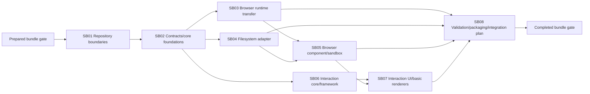

# Phase Plan

## Phase Sequence

1. Prepare/validate bundle and establish solution/package boundaries.
2. Land BCL-only contracts before moving runtime or UI.
3. Transfer/slice browser runtime and independently implement safe filesystem adapter.
4. Build framework-native responsive browser UI only after the runtime and adapter gates pass.
5. Build interaction core before its UI/renderers.
6. Complete FileInteraction UI/basic renderers and browser-to-interaction sandbox flow.
7. Run package, architecture, browser, Components-cleanup, raw-note, and integration-design closure.

## Subbundle Dependency Map

## Critical Subbundles

All eight subbundles — SB01, SB02, SB03, SB04, SB05, SB06, SB07, and SB08 — are critical because each establishes a boundary or behavior whose weakness invalidates downstream proof. Each requires:

- `bundle://proof/SBxx/manifest.md` and `semantic-invariants.md`;
- a named shallow-pass trap;
- adversarial negative and realistic positive proof;
- failing-first/passing transcripts for changed behavior;
- source assertions and anti-stub audit;
- changed-file hashes and portable paths;
- downstream smoke before dependent work proceeds.

UI subbundles additionally require real browser actions, screenshots, and explicit visual review. SB08 includes the final red-team verifier across all manifests.

## Phase Gates

### Prepared gate

- Raw prompt preserved and fully mapped.
- C# architecture artifacts, exact source anchors, patterns, test seams, partial policy, and CodeAnalytics evidence exist.
- `validate_bundle.py --stage prepared` and manual bundle validator pass.

### SB01 -> SB02

- Standalone solution restores/builds.
- Package graph points only inward to Abstractions.
- Abstractions has zero dependencies.

### SB02 -> SB03/SB04/SB06

- Contracts compile and tests prove identity, provider/content lifetime, save/history/options without UI/storage.
- No runtime/Blazor/filesystem type leaks into Abstractions.

### SB03/SB04 -> SB05

- Transferred browser characterization passes.
- Disabled retention/invalidation and root-confined current reads pass negative tests.
- File occurrences expose host invocation capability.

### SB05 -> SB07/SB08

- No direct provider-effect anchors remain.
- File activation raises host event.
- Normal/compact/minimal modes pass large, narrow, and low-height screenshot review.

### SB06 -> SB07

- Interaction resolver, schedulers, dirty/revision, and history work in isolated tests without Razor/full host.

### SB07 -> SB08

- View/Edit, awaited host save, split/debounced preview, undo/redo, text/image/PDF/Markdown/unsupported states pass component and browser proof.

### Final closure

- Standalone FileTools restore/build/test/package and sandbox pass.
- Post-change CodeAnalytics graph/cycle/findings evidence and architecture review pass.
- Components transfer cleanup plus remaining solution build pass.
- CanDoItAll git state shows no task-authored change.
- Every raw note is Solved or explicitly Partially solved with the deferred main-integration phase.
- `validate_bundle.py --stage completed`, manual validator, and red-team proof pass.

## Reopen logic

- Runtime/UI proof revealing a contract leak reopens SB02.
- Stale filesystem/process behavior reopens SB03/SB04.
- Screenshot defects reopen SB05 or SB07; test success is not enough.
- Package/build failure after Components cleanup reopens SB03/SB05 and restores the transfer manifest path.
- Fresh main-repo observations do not reopen shipped FileTools unless they expose a generic contract gap; otherwise update the future-integration plan.
